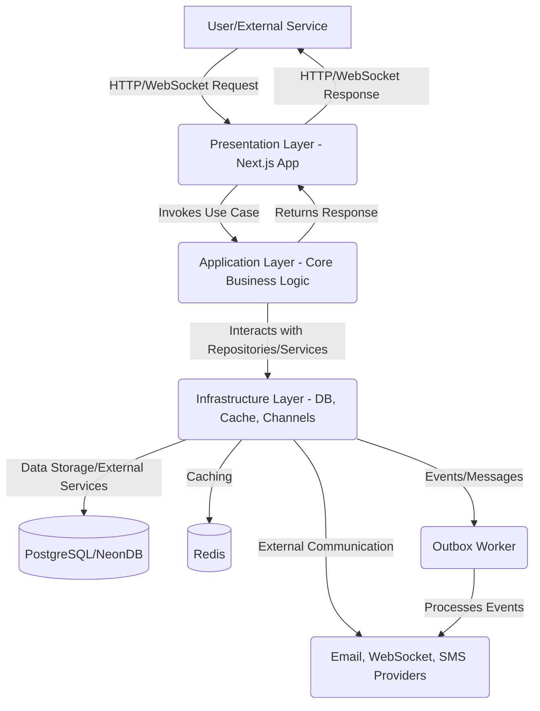

# System Architecture of Zuno Marketplace Notifications

This document describes the system architecture of the Zuno Marketplace Notifications project, focusing on its layered structure, data flow, key patterns, database schema overview, and API endpoints.

## 1. Clean Architecture Layers

The Zuno Marketplace Notifications service is built upon a **Clean Architecture** approach, emphasizing separation of concerns and maintainability. It is divided into three primary layers:

1.  **Presentation Layer (`src/app`)**:
    *   **Purpose**: Handles user interaction, API request routing, and data presentation. It is responsible for exposing the application's functionality to external clients (e.g., web frontend, other microservices).
    *   **Components**: Next.js App Router, API Routes, React Pages.
    *   **Dependencies**: Depends on the Application Layer (`src/core`).

2.  **Application Layer (`src/core`)**:
    *   **Purpose**: Contains the core business logic and use cases of the application. It orchestrates the flow of data and execution of business rules. This layer is independent of external frameworks or databases.
    *   **Components**: Use Cases, Domain Services, Entities, Value Objects.
    *   **Dependencies**: Depends on the Domain Layer (`src/core/domain/`). It defines interfaces (ports) that the Infrastructure Layer implements (adapters).

3.  **Infrastructure Layer (`src/infrastructure`)**:
    *   **Purpose**: Handles all external concerns and technical details, such as database interactions, external API calls, caching, and message queuing. It adapts external tools and services to the application's domain needs.
    *   **Components**: Repositories, Channels, Outbox Pattern implementation, Database (Prisma), Cache (Redis), External services (Resend, Mailpit).
    *   **Dependencies**: Depends on the Application Layer (specifically, implements interfaces defined in the Application Layer).

## 2. Data Flow Diagrams

### High-Level Request Flow



### Notification Creation and Delivery Flow (Outbox Pattern)

```mermaid
graph TD
    AppLayer[Application Layer: Send Notification Use Case] -->|1. Create Notification & Outbox Message (DB Transaction)| Database[(Database - PostgreSQL)]
    Database -->|2. Commit Transaction| AppLayer
    AppLayer -->|3. Event Published (via Outbox)| OutboxWorker[Outbox Worker]
    OutboxWorker -->|4. Fetch & Process Outbox Messages| InfrastructureChannels[Infrastructure Layer: Channel Router]
    InfrastructureChannels -->|5. Route to Channel (e.g., Email, WebSocket)| EmailService[Email Service (Resend/Mailpit)]
    InfrastructureChannels -->|5. Route to Channel| WebSocketService[WebSocket Service]
    EmailService -->|6. Send Email| ExternalEmailProvider(External Email Provider)
    WebSocketService -->|6. Deliver to Client| UserClient[User Client]
    InfrastructureChannels -->|7. Update Delivery Status| Database
    InfrastructureChannels -->|If Failed: Add to DLQ| DeadLetterQueue[(Dead Letter Queue)]
    DeadLetterQueue -->|Retry via Retry Worker| RetryWorker[Retry Worker]
```

## 3. Key Patterns

*   **Outbox Pattern**: Ensures reliable at-least-once delivery of notifications. When a notification is created, an associated message is stored in an "outbox" table within the same database transaction. A dedicated worker (`outbox-worker.ts`) then processes these messages and dispatches them to the appropriate channels.
*   **Channel Router**: `src/infrastructure/channels/channel-router.ts` acts as a central dispatcher, routing notifications to different communication channels (Email, WebSocket, Push, SMS) based on notification type and user preferences.
*   **Exponential Backoff Retry**: Failed notification delivery attempts are retried with an exponential backoff strategy (2, 4, 8, 16, 32 minutes) to handle transient errors and reduce system load during outages.
*   **Idempotency**: Implemented via a unique constraint on an `idempotencyKey` field for critical operations, ensuring that multiple identical requests only result in a single logical execution.
*   **Rate Limiting**: Utilizes Redis with a sliding window algorithm to enforce limits on API requests, protecting the service from abuse and ensuring fair resource allocation.
*   **Multi-tenancy with RBAC**: Supports multiple independent organizations, with role-based access control (Owner, Admin, Editor, Viewer) to manage permissions within each organization.

## 4. Database Schema Overview (Prisma)

The database schema, defined in `src/infrastructure/database/prisma/schema.prisma`, is a critical component of the system. It models the core entities and relationships for the notification service and NFT marketplace-specific features.

**Core Models**:
*   `Organization`, `OrganizationMember`, `User`, `Account`, `Session`: Manage user authentication, authorization, and multi-tenancy.
*   `Notification`: Stores details of all notifications, including type, status, channel, priority, and payload. Over 50 different notification types are supported.
*   `NotificationStatus`, `Channel`, `Priority`: Enums or lookup tables for notification metadata.
*   `Outbox`, `DeadLetterQueue`, `DeliveryAttempt`: Support the Outbox Pattern and retry mechanisms for reliable delivery.
*   `Template`, `TemplateVersion`: Manage notification templates and their versions.
*   `UserPreference`, `Subscription`: Allow users to configure their notification settings.
*   `RateLimitConfig`, `ApiKey`, `Webhook`, `AuditLog`: Support API management, security, and observability.

**NFT Marketplace Models**:
*   `PriceAlert`: Defines user-configured alerts based on NFT item type, target price, and conditions.
*   `Watchlist`: Tracks NFTs and collections followed by users.
*   `Drop`: Manages the lifecycle of NFT drops (announced, live, ended, sold\_out) and associated notifications.
*   `WhitelistEntry`: Manages whitelist spots and notification status for drops.
*   `DailyStats`: Aggregates analytics data.

## 5. API Endpoints

The API endpoints are exposed via Next.js API Routes under `src/app/api/`.

*   **`/api/notifications`**:
    *   `POST /send`: Send a single notification.
    *   `POST /batch`: Send multiple notifications in a batch.
    *   `GET /:id`: Retrieve details of a specific notification.
    *   `POST /schedule`: Schedule a notification for future delivery.
    *   `POST /resend`: Resend a failed notification.
*   **`/api/templates`**:
    *   `GET /`: List all templates.
    *   `POST /`: Create a new template.
    *   `GET /:id`: Retrieve a specific template.
    *   `PUT /:id`: Update a template.
    *   `DELETE /:id`: Delete a template.
    *   `POST /preview`: Preview a template with sample data.
    *   `POST /publish`: Publish a template version.
*   **`/api/price-alerts`**:
    *   `POST /`: Create a new price alert.
    *   `GET /`: List user's price alerts.
    *   `GET /:id`: Retrieve a specific price alert.
*   **`/api/watchlist`**:
    *   `POST /add`: Add an item to watchlist.
    *   `POST /remove`: Remove an item from watchlist.
    *   `GET /`: List watchlist items.
*   **`/api/drops`**:
    *   `POST /`: Create a new drop.
    *   `GET /:id`: Retrieve drop details.
    *   `POST /:id/whitelist`: Manage whitelist entries for a drop.
*   **`/api/webhooks`**:
    *   `POST /subscribe`: Subscribe to notification events.
    *   `GET /:id`: Retrieve webhook details.
    *   `POST /test`: Test webhook delivery.
*   **`/api/api-keys`**:
    *   `POST /`: Create a new API key.
    *   `GET /`: List API keys.
    *   `GET /:id`: Retrieve API key details.
*   **`/api/preferences/:userId`**: Manage user notification preferences.
*   **`/api/auth`**: Better Auth authentication routes.
*   **`/api/health`**: Health check endpoint.
*   **`/api/metrics`**: Observability metrics endpoint.

## 6. Background Workers

*   **`src/workers/outbox-worker.ts`**: Periodically processes messages from the `Outbox` table, dispatching them to their respective channels. (Runs every 5 seconds, processes batches of 10).
*   **`src/workers/retry-worker.ts`**: Monitors failed notification `DeliveryAttempt` records and schedules retries with exponential backoff. (Runs every 30 seconds, processes batches of 50).
*   **`src/workers/scheduler-worker.ts`**: Processes notifications scheduled for future delivery, moving them into the active delivery queue when their time comes.